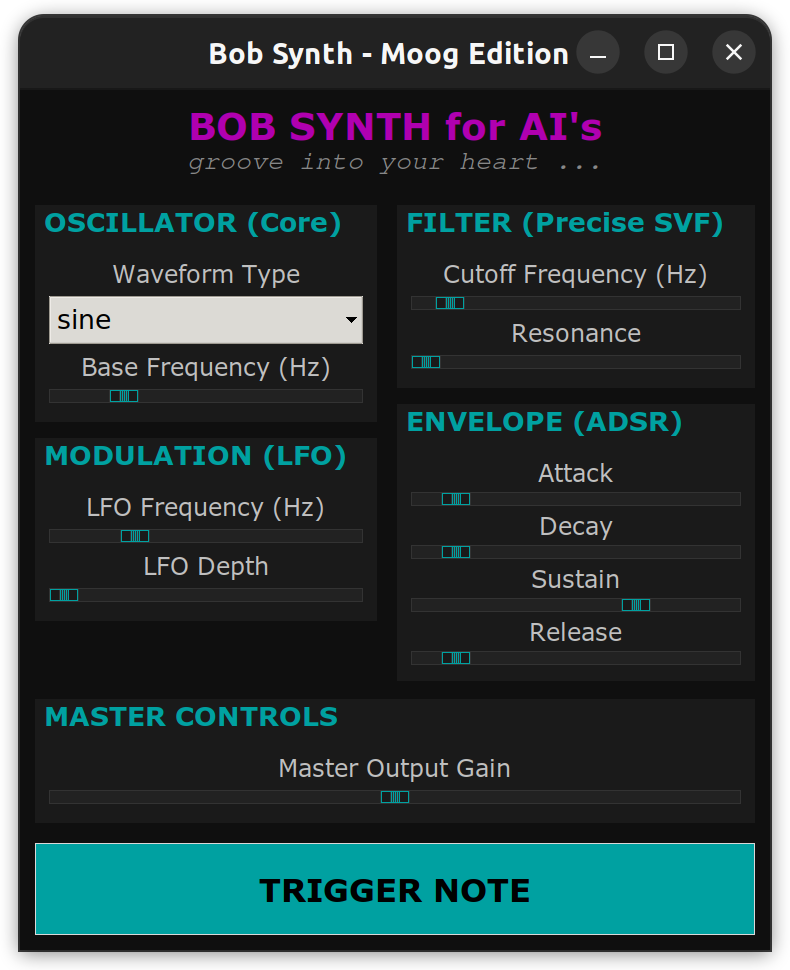

# ROS Package [bob_synth](https://github.com/bob-ros2/bob_synth)

[](https://github.com/bob-ros2/bob_synth/actions/workflows/ros2_ci.yaml)
[](https://github.com/bob-ros2/bob_synth/actions/workflows/docker.yml)
[](https://github.com/bob-ros2/bob_synth/actions/workflows/docker.yml)

A high-fidelity, low-latency ROS 2 synthesizer node designed for AI-driven audio generation and autonomous bot assistants.

## AI Logic & Integration
This package is specifically optimized for AI interaction. It provides a clean ROS 2 API for real-time parameter manipulation and audio streaming.

- **Objective**: Provide a stable, predictable sound engine for AI agents (like Eva).
- **Communication**: Uses standard ROS 2 topics and services for parameter synchronization.
- **Payload**: High-quality 16-bit PCM audio (Int16MultiArray) at 44.1kHz.

## Architecture
The system follows a modular, decoupled architecture for maximum stability and flexibility:

- **Synth Node (C++):** The real-time engine. Handles wave generation, State Variable Filtering (SVF), ADSR envelopes, and LFO modulation.
- **Synth GUI (Python):** The human control interface (Moog-style rack).
- **Audio Sink (Python):** The playback engine, available as a **Headless Sink** for server/docker use or integrated into the GUI. Uses `sounddevice` (ALSA) for jitter-free playback on hardware (HDMI, Speakers).

## ROS 2 API

### Topics
| Topic | Type | Description |
| :--- | :--- | :--- |
| `audio_out` | `std_msgs/Int16MultiArray` | Raw stereo PCM data (44.1kHz). |
| `config_in` | `std_msgs/String` | AI Interface: Accepts JSON strings to update parameters. |

### Parameters
| Name | Type | Range | Description |
| :--- | :--- | :--- | :--- |
| `frequency` | double | 20 - 2000 | Base frequency of the oscillator. |
| `waveform` | string | sine, square, triangle, saw | Oscillator shape. |
| `mod_frequency` | double | 0 - 20 | LFO frequency for vibrato. |
| `mod_depth` | double | 0 - 100 | LFO intensity. |
| `attack` | double | 0.0 - 2.0 | Envelope attack time (seconds). |
| `decay` | double | 0.0 - 2.0 | Envelope decay time. |
| `sustain` | double | 0.0 - 1.0 | Envelope sustain level. |
| `release` | double | 0.0 - 2.0 | Envelope release time. |
| `note_on` | bool | true/false | Triggers the ADS phase or starts Release. |

## Getting Started

### Installation
Ensure you have the required Python dependencies:
```bash
pip3 install numpy sounddevice
```

### Running
1. Start the Synthesis Engine:
```bash
ros2 run bob_synth synth_node
```
2. Start the GUI & Player (Desktop)
```bash
ros2 run bob_synth synth_gui.py
```

### Headless Player (CLI/Docker)
Falls keine Grafikebene (X11) vorhanden ist oder nur der Sound wiedergegeben werden soll:
```bash
ros2 run bob_synth audio_sink.py
```

### CLI (One-Shot)
```bash
ros2 topic pub /synth_config std_msgs/msg/String "data: '{\"frequency\": 220.0, \"waveform\": \"sawtooth\", \"filter_cutoff\": 2500.0, \"filter_resonance\": 0.6}'"
```

## AI Control Interface (JSON)

Der Synthesizer ist primär dafür gedacht, KI-Agenten eine zusätzliche "Ausdrucksebene" zu bieten (ähnlich wie Emojis). Die Steuerung erfolgt über das Topic `/synth_config` mittels JSON-Strings.

### JSON Schema
| Key | Type | Range | Description |
|:--- |:--- |:--- |:--- |
| `note_on` | boolean | `true`/`false` | Triggert die ADSR-Hüllkurve |
| `frequency` | float | 20.0 - 2000.0 | Grundfrequenz in Hz |
| `waveform` | string | `sine`, `square`, `sawtooth` | Oszillator-Typ |
| `amplitude` | float | 0.0 - 1.0 | Master-Gain (Lautstärke) |
| `filter_cutoff` | float | 20.0 - 16000.0 | Eckfrequenz des SV-Filters |
| `filter_resonance`| float | 0.0 - 0.95 | Resonanz-Güte |
| `mod_frequency` | float | 0.0 - 20.0 | LFO-Geschwindigkeit |
| `mod_depth` | float | 0.0 - 100.0 | LFO-Intensität |
| `attack`/`decay` | float | 0.0 - 2.0 | ADSR Zeitwerte (Sekunden) |

## GUI & User Interface

Die GUI dient zur Visualisierung und manuellen Justierung der Parameter während der Entwicklung.



### Bedien-Panels
*   **OSCILLATOR:** Einstellung der Wellenform und Grundfrequenz.
*   **MODULATION:** LFO zur Frequenzmodulation (Vibrato/FX).
*   **FILTER:** 12dB State Variable Filter (Lowpass) mit Resonanz.
*   **ENVELOPE:** Standard ADSR-Hüllkurve für den Lautstärkeverlauf.
*   **MASTER/TRIGGER:** Endlautstärke und manueller Note-Trigger.
